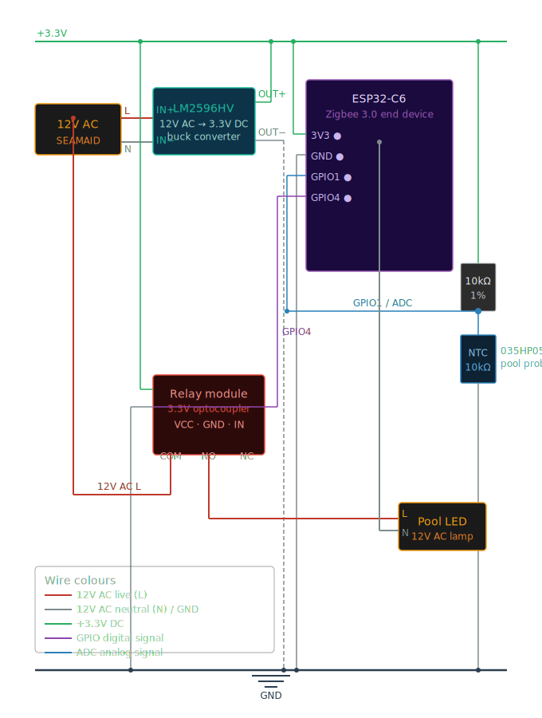

# Zigbee Pool Light Temp

ESP32-C6 based Zigbee 3.0 pool controller — pump light relay + NTC water temperature sensor.

This project was designed to replace the proprietary RF remote control of a [SEAMAID pool light](https://www.zavattishop.com/fr/module-de-commande-radio-switch-1-canal.html) with a Zigbee module that integrates natively into Home Assistant via Zigbee2MQTT.

The three components are mounted on a custom 3D-printed PCB carrier that fits directly inside the SEAMAID waterproof enclosure, replacing the original electronics. The STL file is available in this repository.

Based on the [HA_on_off_light](https://github.com/espressif/esp-idf/tree/master/examples/zigbee/light_sample/HA_on_off_light) example by Espressif.

---

## Features

| Feature | Details |
|---|---|
| Pump/light control | On/Off via Zigbee → relay on GPIO4 |
| Water temperature | NTC 10kΩ probe (035HP05202) on GPIO1 (ADC) |
| Temperature offset | Writable via Zigbee, ±10°C precision at 0.01°C |
| Signal quality | Link quality reported by Zigbee2MQTT |
| Integration | Zigbee2MQTT + Home Assistant |

---

## Bill of Materials

| Component | Reference | Price |
|---|---|---|
| Buck converter | LM2596HV (12V AC → 3.3V DC) | ~€1.89 |
| Relay module | 3.3V 1-channel, dual optocoupler isolation, high/low trigger | ~€1.69 |
| Microcontroller | ESP32-C6 DevKit | ~€7.00 |
| Temperature probe | NTC 10kΩ 035HP05202 | ~€10.00 |
| Reference resistor | 10kΩ 1% (voltage divider) | <€0.10 |
| **Total** | | **~€20.68** |

---

## Hardware

### How it works

The assembly connects directly to the existing 12V AC wiring of the SEAMAID enclosure:

1. The **LM2596HV** buck converter steps down 12V AC to 3.3V DC to power the ESP32-C6 and relay module.
2. The **ESP32-C6** runs the Zigbee stack and reads the NTC probe via ADC.
3. The **relay module** (GPIO4) switches the 12V AC back to the pool LED on command.
4. The **NTC probe** is read via a voltage divider (10kΩ reference resistor on GPIO1).

### Wiring



#### Power supply (LM2596HV)

```
12V AC input ──► LM2596HV IN+/IN-
                 LM2596HV OUT+ ──► ESP32-C6 3V3
                 LM2596HV OUT+ ──► Relay VCC
                 LM2596HV OUT- ──► GND (common)
```

#### Relay (GPIO4)

```
ESP32-C6 GPIO4 ──► Relay IN
Relay VCC      ──► 3.3V
Relay GND      ──► GND
Relay COM      ──► 12V AC (load)
Relay NO       ──► Pool LED 12V AC terminal
```

> The relay interrupts the 12V AC line to the LED. Use the NO (Normally Open) contact so the light is OFF when the ESP32 is unpowered.

#### NTC temperature probe (GPIO1)

```
3.3V
  │
 10kΩ  (1% reference resistor)
  │
  ├──── GPIO1 (ADC1_CH0)
  │
[NTC 10kΩ probe]
  │
GND
```

> Never exceed 3.3V on the ESP32-C6 ADC pin.

---

## Zigbee endpoints

| Endpoint | Cluster | Role |
|---|---|---|
| 10 | On/Off (0x0006) | Relay control |
| 11 | Temperature Measurement (0x0402) | NTC reading |
| 11 | Custom attribute 0xFF00 (int16) | Temperature offset (hundredths of °C) |

---

## Software requirements

- [ESP-IDF v5.3+](https://docs.espressif.com/projects/esp-idf/en/latest/esp32c6/get-started/)
- [ESP-IDF VS Code extension](https://marketplace.visualstudio.com/items?itemName=espressif.esp-idf-extension)
- esp-zigbee-lib v1.6.x (declared in `main/idf_component.yml`)

---

## Build & flash

```bash
# Clone the repository
git clone https://github.com/StaRky33/Zigbee-Pool-Light-Temp.git
cd Zigbee-Pool-Light-Temp

# Set target
idf.py --preview set-target esp32c6

# Erase flash before first use
idf.py -p COM10 erase-flash

# Build and flash
idf.py -p COM10 flash monitor
```

---

## Configuration

### NTC Beta parameter

Open `main/ntc.h` and adjust `NTC_BETA` with your probe's datasheet value:

```c
#define NTC_BETA   3950.0f   // K — typical value for NTC 10kΩ
```

For field calibration:
1. Measure resistance at 0°C (ice water) → R0
2. Measure resistance at 100°C (boiling water) → R100
3. `Beta = ln(R0 / R100) / (1/273.15 - 1/373.15)`

### GPIO assignments

| Constant | File | Default |
|---|---|---|
| `RELAY_GPIO` | `main/relay.h` | GPIO4 |
| `NTC_ADC_CHANNEL` | `main/ntc.h` | ADC_CHANNEL_0 (GPIO1) |

### Temperature report interval

In `main/esp_zb_pool.h`:
```c
#define TEMP_REPORT_INTERVAL_MS  30000   // 30 seconds
```

---

## Zigbee2MQTT integration

After first boot, enable pairing in Zigbee2MQTT. The device appears as **PoolLightTemp** (vendor: STARKYDIY) with:

- `state` (on/off) on endpoint 10
- `temperature` on endpoint 11
- `temperature_offset` (attribute 0xFF00) — write via:

```yaml
# Home Assistant MQTT service
service: mqtt.publish
data:
  topic: zigbee2mqtt/PoolLightTemp/set
  payload: '{"temperature_offset": 0.50}'   # +0.50°C
```

The external converter file (`poolLightTemp.mjs`) is available in the `zigbee2mqtt/` folder of this repository.

---

## Project structure

```
Zigbee-Pool-Light-Temp/
├── CMakeLists.txt
├── idf_component.yml          # Zigbee SDK dependencies
├── sdkconfig.defaults         # ESP-IDF build config
├── partitions.csv             # Flash partition table (Zigbee NVS)
├── stl/                       # 3D-printable PCB carrier for SEAMAID enclosure
├── docs/					   # Images to serve as documentation
├── external_converters/
│   └── poolLightTemp.mjs          # Zigbee2MQTT external converter
└── main/
    ├── CMakeLists.txt
    ├── esp_zb_pool.c          # Entry point, Zigbee stack, endpoints
    ├── esp_zb_pool.h          # Endpoint & attribute constants
    ├── ntc.c                  # ADC reading + Steinhart-Hart equation
    ├── ntc.h
    ├── relay.c                # GPIO4 relay driver
    └── relay.h
```

---

## License

Apache License 2.0 — see [LICENSE](LICENSE).

Based on Espressif ESP-IDF examples (public domain / CC0).
